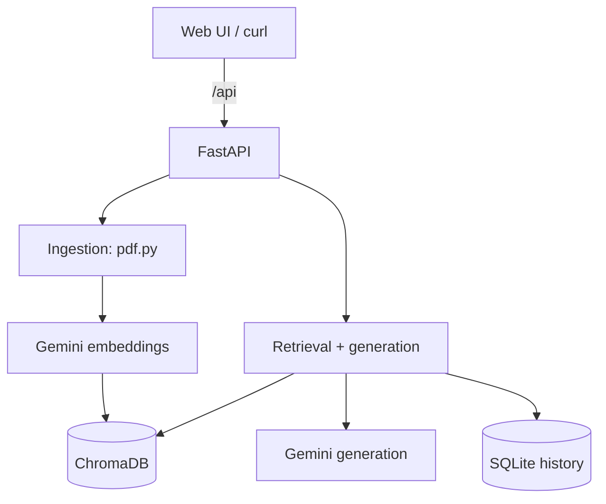
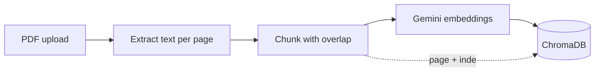
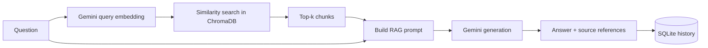

# Architecture

The system has two flows: **ingesting** a document and **answering** a question.
Both lean on Gemini for the heavy lifting (embeddings + generation) and ChromaDB
for the vector index. The FastAPI app also serves the web UI, so the whole thing
runs and deploys as one service.

## Components

| Layer       | Piece                | Responsibility                                  |
|-------------|----------------------|-------------------------------------------------|
| UI          | `app/static/`        | upload + chat in the browser (plain JS)         |
| API         | FastAPI routers      | request validation, auth, HTTP shape            |
| Ingestion   | `pdf.py`             | extract text per page, split into chunks        |
| Embeddings  | `embeddings.py`      | turn text into vectors (Gemini)                 |
| Storage     | `vectorstore.py`     | persist vectors + metadata (ChromaDB)           |
| Retrieval   | `vectorstore.search` | cosine similarity, optional per-document filter |
| Generation  | `llm.py`             | build the RAG prompt, call Gemini, stream        |
| History     | `history.py`         | save and read chat turns (SQLite)               |

## System overview

## Ingestion flow

Each chunk is stored with its `document_id`, `filename`, `page` and `chunk_index`.
That metadata is what lets the answer cite a real location later.

## Query flow

## Design choices

- **One service, not two.** The API serves the static frontend, so there's no
  separate web host, no CORS, and a single deploy. API routes live under `/api`;
  everything else falls through to the UI.
- **Bring-your-own embeddings.** Chroma can embed for you, but we pass Gemini
  vectors in directly so embeddings and generation use one consistent provider.
- **Character-based chunking with overlap.** Simple and predictable. The overlap
  keeps sentences from being cut clean in half at a boundary.
- **Document vs query task types.** Gemini's embedding API distinguishes
  `retrieval_document` from `retrieval_query`; using the right one improves recall.
- **Metadata-driven multi-document.** One collection holds every document; a
  `where` filter on `document_id` scopes a search without separate indexes.
- **Grounded prompt.** The system instruction tells the model to answer only from
  the retrieved context and to say so when the answer isn't there — this is what
  keeps RAG from hallucinating.
- **SQLite for history.** No extra service to run; the session id ties a
  conversation together across requests.
